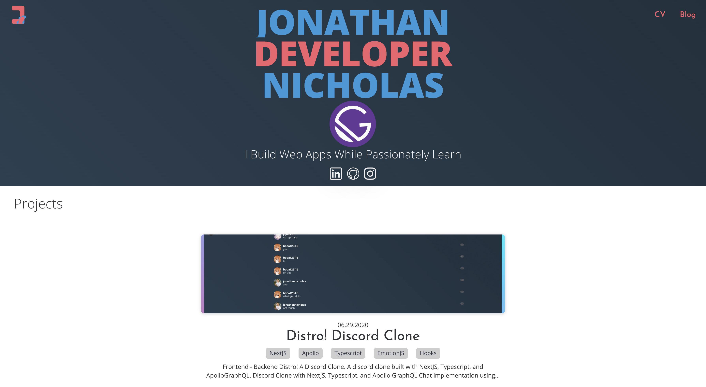
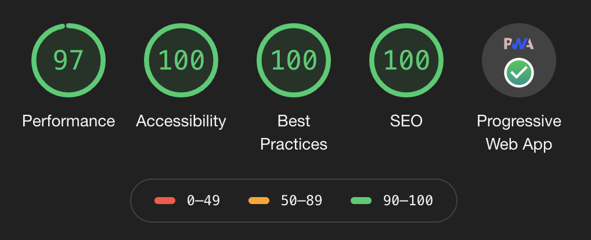

# Portfolio and Blog Web App with Gatsby

- State management using react hooks and styled using Emotion.js
- Implemented backend using GraphQL and Markdown.
- Impacted over 1000 connections on LinkedIn through written [article](https://www.linkedin.com/posts/joni_the-gatsby-project-structure-activity-6667343046142783488-mKfn) about Gatsby.

